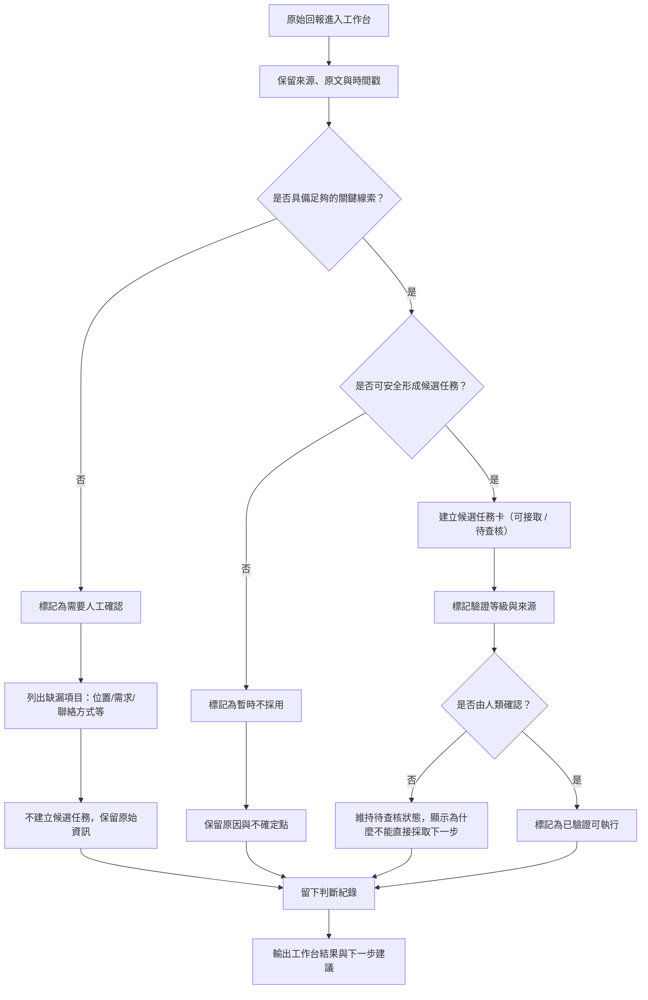

# 資訊流程設計

> 這份文件可以由 Codex 先產生草稿，但你必須用 VS Code 預覽 Mermaid，並由人檢查流程是否合理。

## 我的 v1 目標

- 我優先服務的使用者：行動者（志工／救援隊伍）。
- 這個使用者最想完成的事：盡快判斷一筆回報是否能成為可出發的任務卡，並知道哪些資訊還需要查核。
- 我最想避免的錯誤：把未經驗證或來源不明的資訊誤當成可執行任務，導致志工白跑或進入危險場域。

## 自然語言流程描述

原始回報進入工作台後，先保留來源、原文與時間戳，並把它視為「原始資訊」而不是已確認事實。
接著檢查這筆資訊是否具備足夠的關鍵線索，例如位置、需求描述、聯絡方式與時間資訊；若缺少關鍵欄位，則標示為「需要人工確認」，並提示缺漏項目，例如位置不明、需求不清、聯絡方式缺失。
如果資訊看起來有足夠線索，但還不適合直接派工，則建立一個候選任務卡；這個候選任務卡只表示「待查核」，不代表可派遣，也不代表已驗證。
若沒有人工確認，流程維持待查核狀態，且不把它當作可執行任務輸出；同時顯示為什麼不能直接採取下一步，以及下一步應該如何查核。
只有在人類確認後，才可以把任務卡標為「已驗證可執行」；若資訊被拒絕或暫時不採用，流程仍保留原因與原始資訊，並標記為暫時不能執行。
每一次判斷都要留下紀錄，包含誰做了什麼判斷、為什麼這樣判斷、缺了哪些關鍵資訊，以及是否保留原始資訊與原因。

## Mermaid 流程圖

## 人工確認點

- 當關鍵欄位（例如位置、需求、聯絡方式）缺漏時，必須由人類判斷是否需要補查，並清楚列出缺漏項目。
- 當資訊看似可形成候選任務，但仍有風險或不確定點時，必須由人類決定是否允許進入候選池，並說明為什麼不能直接採取下一步。
- 只有在人類確認後，才能把任務卡標記為「已驗證可執行」。

## 不能自動處理的分支

- 不要讓 AI 自動把模糊地點改寫為精確地址。
- 不要讓 AI 自動把未確認資訊直接顯示為已確認事實。
- 不要讓 AI 自動決定是否要派遣志工或優先順序。
- 不要讓未達可執行門檻的資訊被當成可直接採取下一步的任務。

## 操作或判斷紀錄

- 每次標記為「需要人工確認」或「暫時不採用」時，都要留下原因、判斷者與缺漏項目。
- 每次把任務卡標記為「已驗證」時，都要保留審核者、時間與證據或來源說明。
- 若資訊被拒絕或暫時不採用，流程必須保留拒絕理由與下一步建議，避免後續使用者以為是被忽略。

## 我檢查後修正了什麼

- 原本：流程只把資訊分成「足夠／不足」兩種狀態，沒有明確區分「暫時不採用」與「保留原因」。
- 修正後：新增了「暫時不採用」分支，並把「候選任務卡僅為待查核」、「顯示缺漏項目」與「說明為什麼不能直接採取下一步」明確寫成流程節點。
- 為什麼：這樣可以避免把不確定資訊誤當成候選結果，也更符合行動者需要清楚知道「現在能不能出發」的要求。

## 我仍不確定的流程點

- 可行動門檻的具體標準仍需要後續與運營或產品確認，例如是否必須同時具備地址與聯絡方式。
- 誰有權限把任務卡標記為「已驗證」仍需要後續確認，避免流程在實作後出現權責不清。